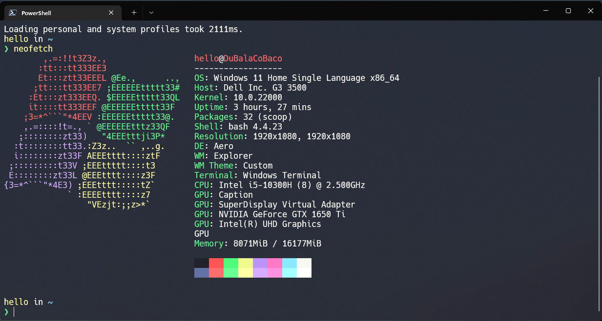

> **WARNING:** This repository was created for personal use only, if you want
> use any script here it is your own risk

Bruno's dotfiles
----

Here you'll find some dotfiles, used when I need to config my Windows again... This happens more
than I would like.

> **Warning:** Don't blindly use my settings unless you know for what each thing
is for.

## Directory structure

    .$env:USERPROFILE\
    └── .config\
        └── powershell
            ├── user_profile.ps1        	# Config file (like .bashrc or .zshrc on linux)
            └── scripts.psm1		        # Scripts to add some 'features' to terminal
    └── AppData\Local\nvim
    	└── init.vim                        # NeoVim config

## Windows Setup

You can find the instructions for Windows [here](WindowsPostInstall.md)

## License
Copyright (c) 2022 Bruno Alves (brunoalves.app)

Permission is hereby granted, free of charge, to any person obtaining a copy of this software and associated documentation files (the “Software”), to deal in the Software without restriction, including without limitation the rights to use, copy, modify, merge, publish, distribute, sublicense, and/or sell copies of the Software, and to permit persons to whom the Software is furnished to do so, subject to the following conditions:

The above copyright notice and this permission notice shall be included in all copies or substantial portions of the Software.

THE SOFTWARE IS PROVIDED “AS IS”, WITHOUT WARRANTY OF ANY KIND, EXPRESS OR IMPLIED, INCLUDING BUT NOT LIMITED TO THE WARRANTIES OF MERCHANTABILITY, FITNESS FOR A PARTICULAR PURPOSE AND NONINFRINGEMENT. IN NO EVENT SHALL THE AUTHORS OR COPYRIGHT HOLDERS BE LIABLE FOR ANY CLAIM, DAMAGES OR OTHER LIABILITY, WHETHER IN AN ACTION OF CONTRACT, TORT OR OTHERWISE, ARISING FROM, OUT OF OR IN CONNECTION WITH THE SOFTWARE OR THE USE OR OTHER DEALINGS IN THE SOFTWARE.
